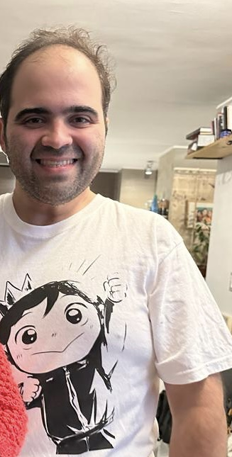

# Abril 2024

## Alonso Astroza

{ align=left, width="200" }

* Soy Subdirector de Alianzas con Empresas en el [Instituto de Ciencia de Datos de la Universidad del Desarrollo](https://ingenieria.udd.cl/persona/alonso-astroza-tagle/).
* Contribuyo en:
    * [GeoVictoria](https://www.geovictoria.com)
    * [Defontana](https://www.defontana.com)
    * [Discolab](https://www.discolab.cl)
    * [Subconscious.ai](https://www.subconscious.ai/)
* Enseño en el [Magister de Ciencia de Datos en la Universidad del Desarrollo](https://ingenieria.udd.cl/postgrado/magister-en-data-science/profesores/).
* Ingeniero Eléctrico de la Universidad de Chile.

### Contacto

* :fontawesome-solid-paper-plane: alonsoastroza@udd.cl
* :fontawesome-brands-github: [aastroza](https://github.com/aastroza)
* :fontawesome-brands-linkedin: [aastrozacl](https://www.linkedin.com/in/aastrozacl/)
* :fontawesome-brands-x-twitter: [aastroza](https://twitter.com/aastroza)