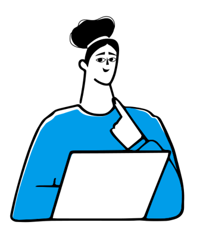

# Comenzando el curso

## Objetivo

Este curso está diseñado para **empoderar a profesionales en el ámbito de los datos**, ofreciendo una comprensión de los conceptos centrales de Machine Learning (ML) **sin la necesidad de conocimientos previos en programación**. A lo largo de cuatro módulos de clases podrás descubrir los fundamentos del ML, los tipos de aprendizaje, la selección y evaluación de modelos, y cómo aplicar estos conocimientos para impulsar decisiones basadas en datos y proyectos de big data.

Al finalizar el curso estarás equipado para **contribuir** efectivamente en discusiones y decisiones relacionadas con proyectos de ML, mejorando las capacidades analíticas y estratégicas de tu equipo.

## Para quiénes está dirigido este curso

{ width="300", align=left }

Si te encuentras en alguna de estas situaciones:

* Eres un profesional que debe **tomar decisiones** sobre algún proyecto de aprendizaje basado en datos.
* Quieres **participar de discusiones** sobre ML sin miedo a demostrar ignorancia en los aspectos fundamentales.
* Odias a los influencers de IA y quieres tener los conocimientos claves para **despejar el humo**.
* Tienes una **gran cantidad de datos** crudos y un **problema** que podría resolverse usándolos. 

Este curso es para tí. Aquí te enterarás de los primeros pasos a seguir.

## Para qué NO SIRVE este curso

En este curso **NO APRENDERÁS**:

* A entender en profundidad los **detalles técnicos** de los modelos de ML.
* A **implementar** soluciones de ML mediante la escritura de código.
* A **mantener** y **monitorear** el desempeño de modelos de ML.

## Bibliografía Esencial

Durante el curso se estará constantemente citando a tres libros fundamentales sobre Machine Learning:

- Abu-Mostafa, Y. S., Magdon-Ismail, M., & Lin, H. (2012). **Learning from data: a short course.** [United States], AMLBook.com.
- Huyen, C. (2022). **Designing Machine Learning System.** [United States], O'Reilly.
- Lakshmanan, V., Robinson, S., & Munn, M. (2020). **Machine Learning Design Patterns.** [United States], O'Reilly.

Si al final del curso tienes curiosidad por aprender más, leer estos libros es una gran idea para seguir avanzando.
 
 

[:fontawesome-solid-thumbtack: Clases](lectures/index.md){ .md-button .md-button--primary } [:fontawesome-solid-message: ¿Preguntas?](questions/index.md){ .md-button }